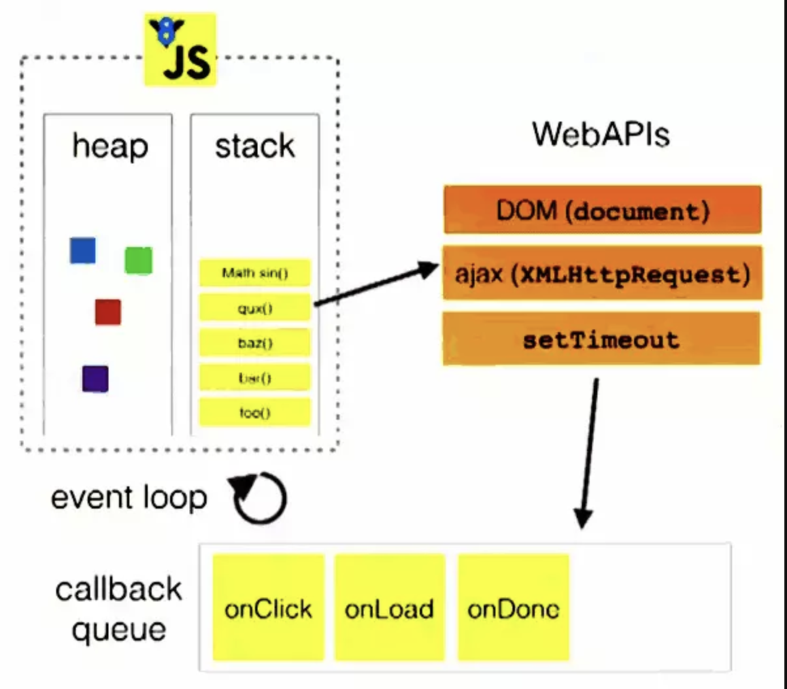
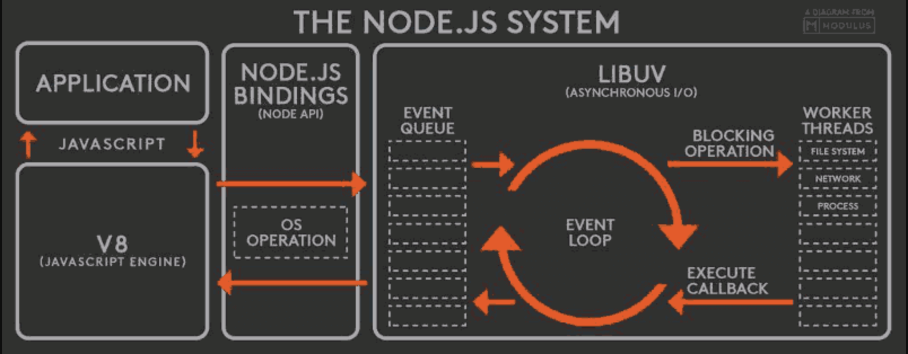
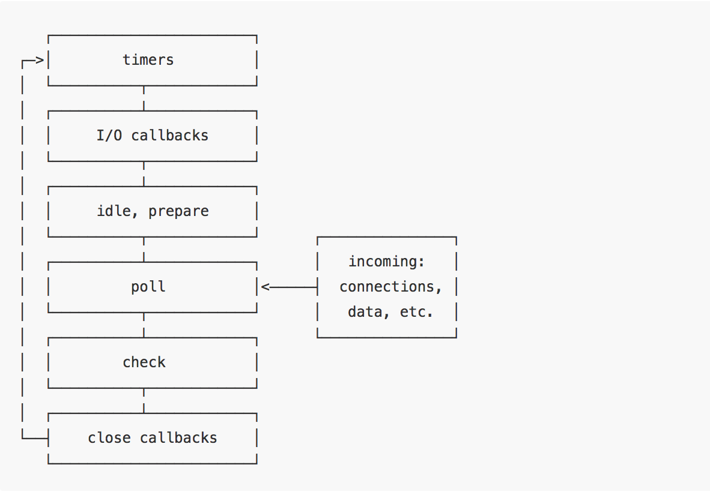

# Event Loop（事件环）

## js是单线程
`JavaScript`语言最大特点就是单线程，但是这里的单线程指的是主线程是单线程的。那为什么js要单线程呢？ 因为，JS主要用于操作DOM，如果是有两个线程，一个在DOM上添加内容，一个在DOM上删除内容，此时浏览器该以哪个为准呢？ 所以为了避免复杂性，JavaScript从诞生起就是单线程的。

## 同步和异步
> 同步和异步关注的是消息通知机制

1. 同步在发出调用后，没有结果前是不返回的，一旦调用返回，就得到返回值。调用者会主动等待这个调用结果。
2. 异步是发出调用后，调用者不会立刻得到结果，而是被调用者通过状态或回调函数来处理这个调用。

## 任务队列
- 因为`JavaScript`是单线程的。就意味着所有任务都需要排队，前一个任务结束，后一个任务才能执行。前一个任务耗时很长，后一个任务也得一直等着。但是IO设备（比如ajax网络请求）很慢，CPU一直处于占用状态，这样就很不合理了。
- 所以，其实主线程完全可以不管IO设备，挂起处于等待中的任务，先运行排在后面的任务。等到IO设备返回了结果，再回过头，把挂起的任务继续执行下去。于是有了`同步任务`和`异步任务`。

> `同步任务`是指在主线程上执行的任务，只有前一个任务执行完毕，下一个任务才能执行。
> `异步任务`是指不进入主线程，而是进入任务队列（`task queue`）的任务，只有主线程任务执行完毕，任务队列的任务才会进入主线程执行。

## 浏览器中`Event Loop`


从上图看到：

1. 主线程运行的时候产生堆（`heap`）和栈（`stack`）
2. 栈中的代码调用各种外部API，它们在"任务队列"中加入各种事件（`click`，`load`，...）
3. 只要栈中的代码执行完毕，主线程就会去读取"`任务队列`"，将队列中的事件放到执行栈中依次执行。
4. 主线程继续执行，当再调用外部API时又加入到任务队列中，等主线程执行完毕又会接着将任务队列中的事件放到主线程中。
5. 上面整个过程是循环不断的。

## Node 的 Event Loop

> Node.js也是单线程的Event Loop，但是它的运行机制不同于浏览器环境。


根据上图，Node.js的运行机制如下：

1. 写的JavaScript脚本会交给V8引擎解析
2. 解析后的代码，调用Node API，Node会交给`Libuv`库处理
3. `Libuv`库将不同的任务分配给不同的线程，形成一个`Event Loop`（事件循环），以异步的方式将任务的执行结果返回给V8引擎
4. V8引擎再将结果返回给用户

> 除了`setTimeout`和`setInterval`这两个方法，Node.js还提供了另外两个与"任务队列"有关的方法：`process.nextTick`和`setImmediate`。

> `process.nextTick`方法可以在当前"执行栈"的尾部----下一次Event Loop（主线程读取"任务队列"）之前----触发回调函数。也就是说，它指定的任务总是发生在所有异步任务之前。
> `setImmediate`方法则是在当前"任务队列"的尾部添加事件，也就是说，它指定的任务总是在下一次Event Loop时执行，这与`setTimeout(fn, 0)`很像。



从上图看出：

1. `timers` 阶段： 这个阶段执行`setTimeout`(callback) and `setInterval`(callback)预定的callback;
2. I/O callbacks 阶段： 执行除了 `close`事件的callbacks、被`timers`(定时器，`setTimeout`、`setInterval`等)设定的callbacks、`setImmediate`()设定的callbacks之外的callbacks;
3. `idle`, `prepare` 阶段： 仅`node`内部使用;
4. `poll` 阶段： 获取新的`I/O`事件, 适当的条件下node将阻塞在这里;
5. `check` 阶段： 执行`setImmediate`() 设定的callbacks;
6. `close` callbacks 阶段： 比如`socket.on`(‘close’, callback)的callback会在这个阶段执行.

> 每一个阶段都有一个装有callbacks的fifo queue(队列)，当event loop运行到一个指定阶段时，node将执行该阶段的fifo queue(队列)，当队列callback执行完或者执行callbacks数量超过该阶段的上限时，event loop会转入下一下阶段.
> **注意上面六个阶段都不包括 process.nextTick()。**process.nextTick()不在event loop的任何阶段执行，而是在各个阶段切换的中间执行,即从一个阶段切换到下个阶段前执行。


## 宏任务和微任务
> 任务可分为宏任务和微任务

常见的宏任务和微任务:
1. `macro-task`(宏任务): `setTimeout`, `setInterval`, `setImmediate`, `I/O`
2. `micro-task`(微任务):`process.nextTick`, 原生`Promise`(有些实现的promise将then方法放到了宏任务中),`Object.observe`(已废弃), `MutationObserver`

看下面的例子：

```javascript
console.log('script start');

setTimeout(function() {
  console.log('setTimeout');
}, 0);

Promise.resolve().then(function() {
  console.log('promise1');
}).then(function() {
  console.log('promise2');
});

console.log('script end');
```

上面代码的执行顺序是什么呢？这是为什么呢？

```javascript
script start
script end
promise1
promise2
setTimeout
```

`Task` 是严格按照时间顺序压栈和执行的，所以浏览器能够使得 `JavaScript` 内部任务与 `DOM` 任务能够有序的执行。当一个 `task` 执行结束后，在下一个 `task` 执行开始前，浏览器可以对页面进行重新渲染。每一个 `task` 都是需要分配的，例如从用户的点击操作到一个点击事件，渲染HTML文档，同时还有上面例子中的 `setTimeout`。

基于前面描述的`event loop`， `setTimeout` 它会在延迟时间结束后分配一个新的 `task` 至 `event loop` 中，而不是立即执行，所以 `setTimeout` 的回调函数会等待前面的 `task` 都执行结束后再运行。这就是为什么 `setTimeout` 会输出在 `script end` 之后，因为 `script end` 是第一个 `task` 的其中一部分，而 `setTimeout` 则是一个新的 task。

`微任务`通常来说就是需要在当前 `task` 执行结束后立即执行的任务，例如需要对一系列的任务做出回应，或者是需要异步的执行任务而又不需要分配一个新的 `task`，这样便可以减小一点性能的开销。

`微任务`任务队列是一个与 `task` 任务队列相互独立的队列，微任务将会在每一个 `task` 任务执行结束之后执行。每一个 `task` 中产生的 微任务 都将会添加到 微任务 队列中，微任务 中产生的 微任务 将会添加至当前队列的尾部，并且 `微任务 会按序的处理完队列中的所有任务`。

每当一个 `Promise` 被生成（或是被拒绝），便会将其回调函数添加至 微任务队列中作为一个新的 微任务。这也保证了 `Promise` 可以异步的执行。所以当我们调用 .`then(resolve, reject)`的时候，会立即生成一个新的 微任务添加至队列中，这就是为什么上面的 `promise1` 和 `promise2` 会输出在 `script end` 之后，因为 微任务队列中的任务必须等待当前 `task` 执行结束后再执行，而 `promise1` 和 `promise2` 输出在 `setTimeout` 之前，这是因为 `setTimeout` 是一个新的 task，而 微任务执行在当前 `task` 结束之后，下一个 `task` 开始之前。