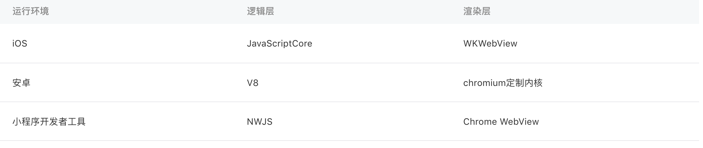
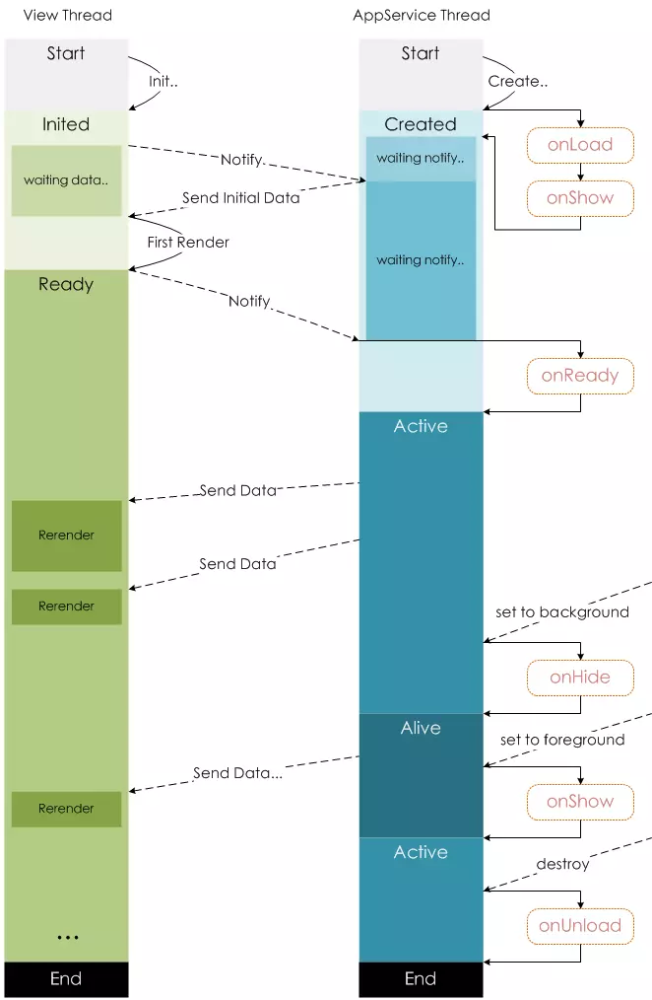

# 微信小程序

## 摘要
小程序是一种全新的连接用户与服务的方式，它可以在微信内被便捷地获取和传播，同时具有出色的使用体验。

​小程序并非凭空冒出来的一个概念。当微信中的 WebView 逐渐成为移动 Web 的一个重要入口时，微信就有相关的 JS API 了。

小程序是一种不需要下载安装即可使用的应用，它实现了应用“触手可及”的梦想，用户扫一扫或者搜一下即可打开应用。

可以理解成一套嵌套在微信里面的app，和原生app不同的是不需要下载，属于小而轻的应用。

## 小程序与普通网页开发的区别
​小程序的主要开发语言是 JavaScript ，小程序的开发同普通的网页开发相比有很大的相似性。对于前端开发者而言，从网页开发迁移到小程序的开发成本并不高，但是二者还是有些许区别的。

​网页开发渲染线程和脚本线程是互斥的，这也是为什么长时间的脚本运行可能会导致页面失去响应，而在小程序中，二者是分开的，分别运行在不同的线程中。网页开发者可以使用到各种浏览器暴露出来的 DOM API，进行 DOM 选中和操作。而如上文所述，小程序的逻辑层和渲染层是分开的，逻辑层运行在 JSCore 中，并没有一个完整浏览器对象，因而缺少相关的DOM API和BOM API。这一区别导致了前端开发非常熟悉的一些库，例如 jQuery、 Zepto 等，在小程序中是无法运行的。同时 JSCore 的环境同 NodeJS 环境也是不尽相同，所以一些 NPM 的包在小程序中也是无法运行的。

网页开发者需要面对的环境是各式各样的浏览器，PC 端需要面对 IE、Chrome、QQ浏览器等，在移动端需要面对Safari、Chrome以及 iOS、Android 系统中的各式 WebView 。而小程序开发过程中需要面对的是两大操作系统 iOS 和 Android 的微信客户端，以及用于辅助开发的小程序开发者工具，小程序中三大运行环境也是有所区别的



网页开发者在开发网页的时候，只需要使用到浏览器，并且搭配上一些辅助工具或者编辑器即可。小程序的开发则有所不同，需要经过申请小程序帐号、安装小程序开发者工具、配置项目等等过程方可完成。


## 微信小程序原理
微信小程序使用了前端技术栈 JavaScript/WXML/WXSS。但和常规的前端开发又有一些区别：
- JavaScript: 微信小程序的 JavaScript 运行环境即不是 Browser 也不是 Node.js。它运行在微信 App 的上下文中，不能操作 Browser context 下的 DOM，也不能通过 Node.js 相关接口访问操作系统 API。所以，严格意义来讲，微信小程序并不是 Html5，虽然开发过程和用到的技术栈和 Html5 是相通的。
- WXML: 作为微信小程序的展示层，并不是使用 Html，而是自己发明的基于 XML 语法的描述。
- WXSS: 用来修饰展示层的样式。官方的描述是 “ WXSS (WeiXin Style Sheets) 是一套样式语言，用于描述 WXML 的组件样式。WXSS 用来决定 WXML 的组件应该怎么显示。” “我们的 WXSS 具有 CSS 大部分特性...我们对 CSS 进行了扩充以及修改。”基于 CSS2 还是 CSS3？大部分是哪些部分？是否支持 CSS3 里的动画？不得而知。

## 开发前的准备
1. 注册账号或者使用测试账号
2. 下载开发工具
3. 注册好后登录下微信公众平台，在设置里找到开发设置，把appID保存下来，一会开发的时候需要用到

## 运行环境
- 微信 App 里包含 javascript 运行引擎。
- 微信 App 里包含了 WXML/WXSS 处理引擎，最终会把界面翻译成系统原生的控件，并展示出来。这样做的目的是为了提供和原生 App 性能相当的用户体验。

我们来分析一下小程序加载运行的过程：

- 用户点击打开一个小程序
- 微信 App 从微信服务器下载这个小程序
- 分析 app.json 得到应用程序的配置信息（导航栏，窗口样式，包含的页面列表等）
- 加载并运行 app.js
- 加载并显示在 app.json 里配置的第一个页面

这个只是从开发者眼中看到的一个简化版的过程，实际过程应该比这要复杂得多，涉及到浏览器线程（就是运行我们的逻辑层代码 app.js 等的线程）和 AppService 线程之间的交互。从官方网站上的一个图片可以看出端倪：



至于微信 App 是如何与小程序的逻辑层 javascript 交互的呢？可以简单地归纳如下：

JavaScript 是脚本语言，可以在运行时解释并执行。微信 App 里包含了一个 JavaScript 引擎，由它来负责执行逻辑层的 JavaScript 代码。那么 JavaScript 调用的小程序相关 API 怎么实现的呢？答案是最终会被翻译成实现在微信 App 里的原生接口。比如开发者调用 wx.getLocation(OBJECT) 获取当前地理位置，微信 App 里的 JavaScript 引擎在执行这个代码时，会去调用微信 App 里实现的原生接口来获取地理位置坐标。

## 设计理念
小程序内部可以理解成一个mvvm的框架，分为逻辑层和视图层，逻辑层将数据进行处理后发送给视图层，同时接受视图层的事件反馈。

```javascript
Page({
  data:{  // 页面的初始数据
      text: 'hello world'
  },
  onLoad(){
    console.log('hello')
  },
  change(){
    this.setData({
    text:'hello'
  })
  }
})
```
使用Page函数来注册一个页面，接收一个Object参数。 这里我们使用了onLoad来监听页面的加载和定义了一个change函数 并使用setData函数将text的值进行更改

更改data数据的时候必须调用setData函数进行更改
```javascript
<view>{{text}}</view> //  显示hello world
<button bindtap="change">点击更改上面文字</button> //  显示hello 
```

事件传递参数
```javascript
<button data-test="哈哈"  bindtap="change">点击我</button>
```

使用e.currentTarget.dataset来获取值
```javascript
change(e){
  e.currentTarget.dataset.test  // 哈哈
}
```

## 路由
小程序里面所有的页面路由由框架进行管理
我们可以使用getCurrnetPages函数获取当前页面栈的实例，返回一个数组, 最后一个元素为当前页面

## WXS
WXS是小程序的一套脚本语言，首先和js是不同的语言，其次运行环境和js也是隔离开的，wxs不能调用js文件中的函数，也不能调用小程序的API，它主要用来增强wxml。

## tip
1. wxss 文件里面不能使用本地图片，请使用base64、网上图片或者image
2. component 组件默认是使用内部样式不能引用外部样式
3. component 组件接收父级参数properties必须先要生命
4. page生命周期 onLoad只在页面渲染完执行一次， onShow每次进入页面或者切换后台执行
5. 不要再页面渲染中使用动态数据，如：`this.state['doctorlist'+type]`
6. 页面最多支持10个历史栈，tabbar最少2个至多5个
7. image 默认不是长宽比缩放的， widthFix模式下初次渲染会有拉伸的现象，尽量用css做背景或者限制一个图片的最大高、查看长宽比里进行设置
8. 注意命名不要与原生组件重叠，如modal、button
9. 尽量简化代码，减少代码体积，小程序规定最大体积为2M
10. css 重读代码尽量写到全局去


