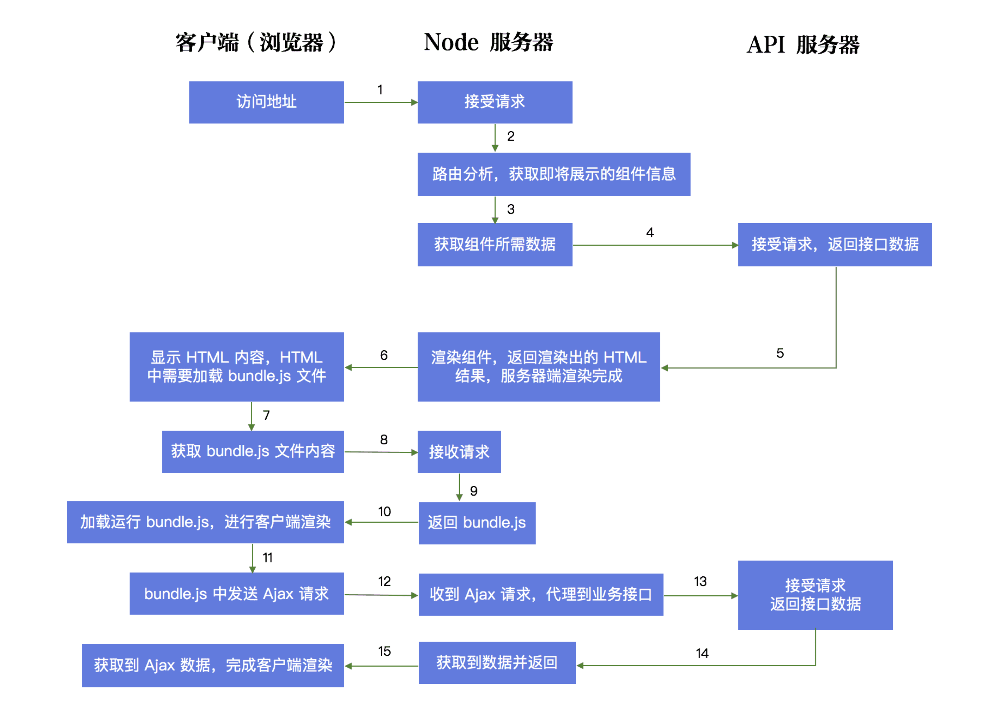

# REACT SSR

## 简介
前端框架层出不穷，目前主流的前端三剑客Vue、React、Angular为主，随着越来越多的框架的推出，框架方面已经是饱和状态慢慢注重了项目性能、体验方面的探究，所以SSR这个概念在前端开发领域的流行度越来越高，也有越来越多的项目采用这种技术方案进行了实现。SSR 产生的背景是什么？适用的场景是什么？实现的原理又是什么？

## 浅谈SPA、SEO、SSR
前后端分离算是最近Web开发的大趋势了，目前已经有大量的公司使用了前后端分离的开发方式。那我们就来大概谈谈前后端分离开发中必须要了解和接触的几个概念：SPA、SEO和SSR。

传统的Web前后端开发大多是前端将页面写好，之后丢给后端，让后端将页面集成到项目中去。这里就存在着一个前后端耦合的问题，首先对于后端来说，不仅要写后端逻辑，还得集成前端页面。而对于前端来说，不是很轻松地就能看到页面的真正渲染出来的样子，显示有利于开发调试的，这里的效率自然也成了问题。也正是由于前后端的高耦合，使得任何一方的变化都可能会影响到另一方。

### 概念
前后端根据`AJAX`接口进行数据的交互，目前常见的是后端直接将数据以`JSON`的格式返回给前端，前端根据后端服务器返回的数据，操作`DOM`

## 主要优点
- 分工明确，前后端各司其职，后端专注业务逻辑和功能的实现，前端专注页面设计。
- 接口明确，并行开发，在后端接口没有实现好之前，前端完全可以自己通过Mock、Node.js等的Web框架模拟接口，提供测试数据。
- 提高开发效率，一定程度上减少了前后端的沟通成本

## SPA
`SPA`全称是 `single page application` 单页面应用

`SPA`是一种 `网络应用程序(WebApp)`模型。在传统的网站中，不同的页面之间的切换都是直接从服务器加载一整个新的页面，而在`SPA`这个模型中，是通过动态地重写页面的部分与用户交互，而避免了过多的数据交换，响应速度自然相对更高。

### SPA优点
- 页面之间的切换非常快
- 一定程度上减少了后端服务器的压力（不用管页面逻辑和渲染)

### SPA的缺点
- 首屏打开速度很慢，因为用户首次加载需要先下载SPA框架及应用程序的代码，然后再渲染页面。
- 不利于SEO

## SEO
`SEO（Search Engine Optimization）`，中文一般译作：搜索引擎优化。`SEO`是一种通过了解搜索引擎的运作规则（如何抓取网站页面，如何索引以及如何根据特定的关键字展现搜索结果排序等）来调整网站，以提高该网站在搜索引擎中某些关键词的搜索结果排名。

搜索引擎优化中的技术大致可以分两类：白帽技术与黑帽技术，
SEO涉及细节也很多，以下是维基百科对于一些白帽技术的介绍：

> - 在每页使用一个短、独特和相关的标题。
> - 编辑网页，用与该页的主题。有关的具体术语替换隐晦的字眼。这有助于该站诉求的观众群，在搜索引擎上搜索而被正确导引至该站。
> - 在该站点增加相当数量的原创内容。
> - 使用合理大小、准确描述的汇标，而不过度使用关键字、惊叹号、或不相关标题术语。
> - 注意网址字眼，有助于搜索引擎优化。
> - 确认所有页可透过正常的链接来访问，而非只能透过Java 、JavaScript或Adobe Flash应用程序访问。
> - 透过自然方式开发链接：Google不花功夫在这有点混淆不清的指南上。写封电子邮件给网站员，告诉他：您刚刚贴了一篇挺好的文章，并且请求链接，这种做法很可能为搜索引擎所认可。
> - 参与其他网站的网络集团（译按：web ring 指的是有相同主题的结盟站群）──只要其它网站是独立的、分享同样题目和可比较的品质。

除去非开发细节，我们大该可以提炼出以下的信息：

- 标题： 即HTML的 `<title></title>` 标签，例如： `<title>`浅谈SPA、SEO、SSR | XXX 的博客`</title>` ，在Google的相关文档中已经说明了不再使用`<title>` 标签作为`Meta`，但是经常会配合 `description`出现在搜索的结果上

- 描述： 即HTML`<meta>`标签的`description`，例如百度百科的一个词条的 `description`：

```html
<meta name="description" content="说明" />
```

- 关键字： 即`HTML<meta>`标签的`keywords`

```html
<meta name="keywords" content="说明" />
```

## SPA与SEO的冲突

我们谈到的SPA不利于SEO，因为就目前而言，部分搜索引擎如`Google、bing`等，它们的爬虫虽然已经支持执行`JS`甚至是通过`AJAX`获取数据了，但是对于异步数据的支持也还不足(也可能是搜索引擎提供商觉得没必要)

> 所以spa页面都是通过异步获取数据渲染的也买呢，所以搜索引擎抓到的数据只一个空白的模板也买呢

谈到过`SPA`应用中，通常通过`AJAX`获取数据，而这里就难以保证我们的页面能被搜索引擎正常收录到。并且有一些搜索引擎不支持执行`JS`和通过`AJAX`获取数据，那就更不用提`SEO`了。

对于一些王章`SEO`是很重要的，一些资讯类、媒体类，比如：`今日头条、豆瓣、stackoverflow、知乎`等等。那如何才能正常使用`SPA`而又不影响`SEO`呢？

所以。SSR便闪亮登场了

## SSR

### 概述

`SSR`是 `Server-Side Rendering`(服务器端渲染)的缩写，在普通的SPA中，一般是将框架及网站页面代码发送到浏览器，然后在浏览器中生成和操作`DOM`（这里也是第一次访问`SPA`网站在同等带宽及网络延迟下比传统的在后端生成HTML发送到浏览器要更慢的主要原因），但其实也可以将`SPA`应用打包到服务器上，在服务器上渲染出`HTML`，发送到浏览器，这样的`HTML`页面还不具备交互能力，所以还需要与`SPA`框架配合，在浏览器上“混合”成可交互的应用程序。所以，只要能合理地运用`SSR`技术，不仅能一定程度上解决首屏慢的问题，还能获得更好的`SEO`。

### SSR的优点
- 更快的响应时间。
- 更好的`SEO`，我们可以将`SEO`的关键信息直接在后台就渲染成H`TML`，而保证搜索引擎的爬虫都能爬取到关键数据。

### SSR的缺点
- 相对于仅仅需要提供静态文件的服务器，SSR中使用的渲染程序自然会占用更多的CPU和内存资源
- 一些常用的浏览器API可能无法正常使用，比如`window、docment和alert`等，如果使用的话需要对运行的环境加以判断
- 开发调试会有一些麻烦，因为涉及了浏览器及服务器，对于SPA的一些组件的生命周期的管理会变得复杂


## 使用 SSR 技术的主要因素：
1. `CSR` 项目的 `TTFP（Time To First Page）`时间比较长，在 `CSR` 的页面渲染流程中，首先要加载 `HTML` 文件，之后要下载页面所需的 `JavaScript` 文件，然后 `JavaScript` 文件渲染生成页面。在这个渲染过程中至少涉及到两个 `HTTP` 请求周期，所以会有一定的耗时，这也是为什么大家在低网速下访问普通的 `React` 或者 `Vue` 应用时，初始页面会有出现白屏的原因。

2. `CSR` 项目的 `SEO` 能力极弱，在搜索引擎中基本上不可能有好的排名。因为目前大多数搜索引擎主要识别的内容还是 `HTM`L，对 `JavaScript` 文件内容的识别都还比较弱。如果一个项目的流量入口来自于搜索引擎，这个时候你使用`SSR` 进行开发，就非常不合适了。

`SSR` 的产生，主要就是为了解决上面所说的两个问题。在 `React` 中使用 `SSR` 技术，我们让 `React` 代码在服务器端先执行一次，使得用户下载的 `HTML` 已经包含了所有的页面展示内容，这样，页面展示的过程只需要经历一个` HTTP` 请求周期，`TTFP` 时间得到一倍以上的缩减。

同时，由于 `HTML` 中已经包含了网页的所有内容，所以网页的 `SEO` 效果也会变的非常好。之后，我们让 `React` 代码在客户端再次执行，为 `HTML` 网页中的内容添加数据及事件的绑定，页面就具备了 `React` 的各种交互能力。

我们来看一下在 React 中实现 SSR 技术的架构图：


使用 SSR 这种技术，将使原本简单的 React 项目变得非常复杂，项目的可维护性会降低，代码问题的追溯也会变得困难。

所以，使用 SSR 在解决问题的同时，也会带来非常多的副作用，有的时候，这些副作用的伤害比起 SSR 技术带来的优势要大的多。
一般建议大家，除非你的项目特别依赖搜索引擎流量，或者对首屏时间有特殊的要求，否则不建议使用 SSR。

## SSR 中客户端渲染与服务器端渲染路由代码的差异

实现 React 的 SSR 架构，我们需要让相同的 React 代码在客户端和服务器端各执行一次。大家注意，这里说的相同的 React 代码，指的是我们写的各种组件代码，所以在同构中，只有组件的代码是可以公用的，而路由这样的代码是没有办法公用的，思考下这是为什么呢？其实原因很简单，在服务器端需要通过请求路径，找到路由组件，而在客户端需通过浏览器中的网址，找到路由组件，是完全不同的两套机制。

### 客户端路由：
```js 
const App = () => {
  return (
    <Provider store={store}>
      <BrowserRouter>
        <div>
          <Route path='/' component={Home}>
  		</div>
      </BrowserRouter>
    </Provider>
  )
}

ReactDom.render(<App/>, document.querySelector('#root'))

```

客户端路由代码非常简单，大家一定很熟悉，BrowserRouter 会自动从浏览器地址中，匹配对应的路由组件显示出来。

### 服务器端路由代码：
```js 
const App = () => {
  return 
    <Provider store={store}>
      <StaticRouter location={req.path} context={context}>
        <div>
          <Route path='/' component={Home}>
        </div>
      </StaticRouter>
    </Provider>
}

Return ReactDom.renderToString(<App/>)

```
服务器端路由代码相对要复杂一点，需要你把 `location`（当前请求路径）传递给 `StaticRouter` 组件，这样 `StaticRouter` 才能根据路径分析出当前所需要的组件是谁。

通过 `BrowserRouter` 我们能够匹配到浏览器即将显示的路由组件，对浏览器来说，我们需要把组件转化成 `DOM`，所以需要我们使用 `ReactDom.render` 方法来进行 DOM 的挂载。而 `StaticRouter` 能够在服务器端匹配到将要显示的组件，对服务器端来说，我们要把组件转化成字符串，这时我们只需要调用 `ReactDom` 提供的 `renderToString` 方法，就可以得到 `App` 组件对应的 `HTML` 字符串。

## SSR 中异步数据的获取 + Redux 的使用

客户端渲染中，异步数据结合 Redux 的使用方式遵循下面的流程

1. 创建 Store
2. 根据路由显示组件
3. 派发 Action 获取数据
4. 更新 Store 中的数据
5. 组件 Rerender

而在服务器端，页面一旦确定内容，就没有办法 Rerender 了，这就要求组件显示的时候，就要把 Store 的数据都准备好，所以服务器端异步数据结合 Redux 的使用方式

1. 创建 Store
2. 根据路由分析 Store 中需要的数据
3. 派发 Action 获取数据
4. 更新Store 中的数据
5. 结合数据和组件生成 HTML，一次性返回

下面，我们分析下服务器端渲染这部分的流程：
1. 创建 Store：这一部分有坑，要注意避免，大家知道，客户端渲染中，用户的浏览器中永远只存在一个 Store，所以代码上你可以这么写：

```js
const store = createStore(reducer, defaultState)
export default store;
```

然而在服务器端，这么写就有问题了，因为服务器端的 Store 是所有用户都要用的，如果像上面这样构建 Store，Store 变成了一个单例，所有用户共享 Store，就有问题了。所以在服务器端渲染中，Store 的创建应该像下面这样，返回一个函数，每个用户访问的时候，这个函数重新执行，为每个用户提供一个独立的 Store：

```js 
const getStore = (req) => {
  return createStore(reducer, defaultState);
}
export default getStore;
```

2. 根据路由分析 Store 中需要的数据： 要想实现这个步骤，在服务器端，首先我们要分析当前出路由要加载的所有组件，这个时候我们可以借助一些第三方的包，例如：react-router-config, 具体这个包怎么使用，大家可以查看文档，使用这个包，传入服务器请求路径，它就会帮助你分析出这个路径下要展示的所有组件。

3. 派发 Action 获取数据: 接下来，我们在每个组件上增加一个获取数据的方法：

```js
// store/actions/detail.js
export const fetchDetail = id => ({
    types: [
        detailActionTypes.DETAIL_FETCH,
        detailActionTypes.DETAIL_SUCCESS,
        detailActionTypes.DETAIL_FAILURE
    ],
    sync: () => api.detail({ id })
})

// pages/detail.js

function mapDispatchToProps(dispath) {
    return {
        fetchDetail: (id) => dispath(detailActions.fetchDetail(id)),
        reset: () => dispath(detailActions.reset())
    }
}

static asyncData(store, match) {
        const { fetchDetail } = mapDispatchToProps(store.dispatch);
        return fetchDetail(match.params.id);
    }
```

这个方法需要你把服务器端渲染的 `Store` 传递进来，它的作用就是帮助服务器端的 `Store` 获取到这个组件所需的数据。 所以，组件上有了这样的方法，同时我们也有当前路由所需要的所有组件，依次调用各个组件上的 `asyncData` 方法，就能够获取到路由所需的所有数据内容了。


4. 更新 Store 中的数据: 其实，当我们执行第三步的时候，已经在更新 Store 中的数据了，但是，我们要在生成 HTML 之前，保证所有的数据都获取完毕，这怎么处理呢？

```js 
import { matchRoutes } from 'react-router-config';

export default ctx => {
    return new Promise((resolve, reject) => {
        const { router, store, routerConfig } = createApp();

        const routes = matchRoutes(routerConfig, ctx.url);

        // 如果没有匹配上路由则返回404
        if (routes.length <= 0) {
            return reject({ code: 404, message: 'Not Page' });
        }

        // 等所有数据请求回来之后在render, 注意这里不能用ctx上的路由信息，要使用前端的路由信息
        const promises = routes
        .filter(item => item.route.component.asyncData)
        .map(item => item.route.component.asyncData(store, item.match));

        Promise.all(promises).then(() => {
            ctx.store = store; // 挂载到ctx上，方便渲染到页面上
            resolve(
                <Provider store={store}>
                    <StaticRouter location={ctx.url} context={ctx}>
                        { router }
                    </StaticRouter>
                </Provider>
            )
        }).catch(reject);
    })
}
```

这里，我们使用 `Promise` 来解决这个问题，我们构建一个 `Promise` 队列，等待所有的 `Promise` 都执行结束后，也就是所有 `store.dispatch` 都执行完毕后，再去生成 `HTML`。这样的话，我们就实现了结合 `Redux 的 SSR` 流程。

## Node 只是一个中间层
在 SSR 架构中，一般 Node 只是一个中间层，用来做 React 代码的服务器端渲染，而 Node 需要的数据通常由 API 服务器单独提供。

这样做一是为了工程解耦，二也是为了规避 Node 服务器的一些计算性能问题。

服务器端渲染时，直接请求 API 服务器的接口获取数据没有任何问题。但是在客户端，就有可能存在跨域的问题了，所以，这个时候，我们需要在服务器端搭建 Proxy 代理功能，客户端不直接请求 API 服务器，而是请求 Node 服务器，经过代理转发，拿到 API 服务器的数据。

你可以通过 express-http-proxy 这样的工具帮助你快速搭建 Proxy 代理功能，但是记得配置的时候，要让代理服务器不仅仅帮你转发请求，还要把 cookie 携带上，这样才不会有权限校验上的一些问题。

```js 
// Node 代理功能实现代码
app.use('/api', proxy('http://apiServer.com', {
  proxyReqPathResolver: function (req) {
    return '/ssr' + req.url;
  }
}));

```


## 总结
`SSR`配置起来还是比较麻烦的一个东西，不只是前端层面上的配置，还需要考虑到后端程序相关的东西，例如登录态、高并发、负载均衡、内存管理等，很多人表示对于 `SSR` 不太看好，其主要是用于 `SEO`，不太建议用做服务端渲染，其能够使用的场景不多，而且成本代价太大。

所以对于实际开发来说，个人更建议直接使用业内相对成熟的轮子，例如 `React`的 `Next.js`，`Vue`的 `Nuxt.js`