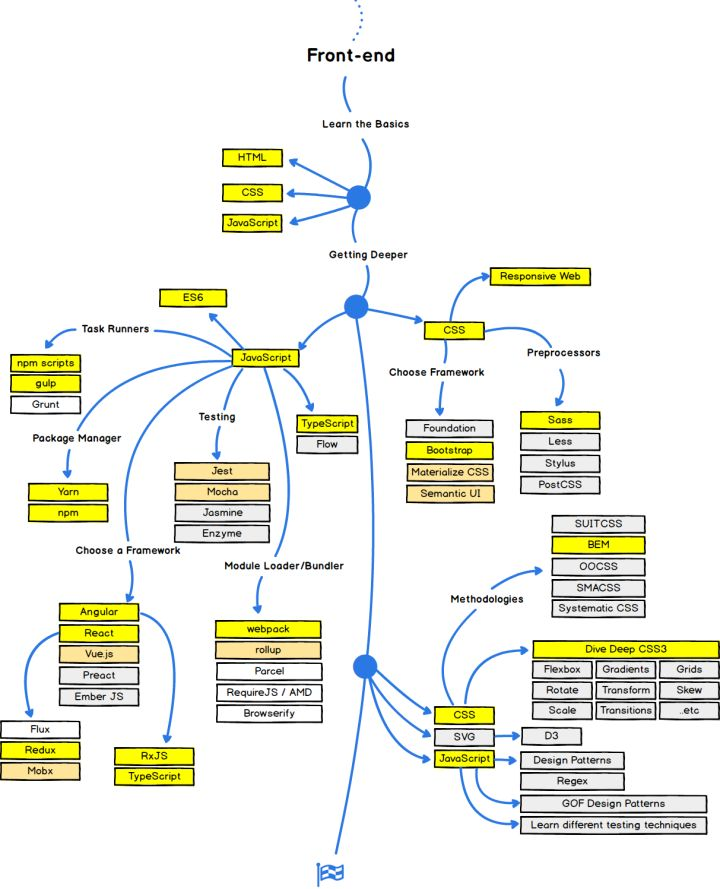

# 浅谈WEB的发展

## 现状

### 早期的前端
从狭义上讲，前端工程师主要使用HTML、CSS、JavaScript 等专业技能和工具将产品UI设计稿实现成网站产品，涵盖用户PC端、移动端网页，处理视觉和交互问题。

Web 1.0时代，前端的主要工作就是绘制模板页面，由html+css来绘制视图，而js这部分则是由后端完成的。前端的发展离不开浏览器的发展。随着Ajax技术诞生，改变了一切。前端不再是后端的模板，可以独立得到各种数据。

Web 2.0时代时代，Ajax技术促成了 Web 2.0 的诞生，动态网页，富交互，前端数据处理

这就是前端早期的发展史，当时对于前端的要求并不高，只要掌握html css js和一个jquery就足够开发网页了

### 新时代的前端
- HTML已经发展到了HTML5
- CSS已经发展到CSS3.0
- JavaScript已经发展到ES9，但是常用的还是ES5和ES6
- 现代标准浏览器(遵循W3C标准的浏览器)基本已经支持HTML5 CSS3 ES6的大部分特性

2009年Ryan Dahl发布了node，node是一个基于V8引擎的服务端JavaScript运行环境，类似于一个虚拟机，也就是说js在服务端语言中有了一席之地。如果说ajax是前端的第一次飞跃，那么node可算作前端的第二次飞跃。它意味着JavaScript走出了浏览器的藩篱，迈出了全端化的第一步。

2014年，第五代HTML标准发布。H5是由浏览器厂商主导，与W3C合作制定的一整套Web应用规范，至今仍在不断补充新的草案。我们可以清晰的感受到这一系列规范背后隐含的领导者的勃勃雄心：占领所有屏幕。

得益于前端技术和浏览器的发展，现在的网页能展示越来越丰富的内容了，比如动画 游戏 画图等等。所以，对于前端的要求也越来越高，特别是近几年框架、技术、工具呈爆发式发展，前端变化特别快！

随着nodejs以及现代标准浏览器的发展前端已经向工程化、模块化发展，已经不再是简单html++css+js+jq项目组成，各种工程化工具如：webpacl、rollup、gulp、grunt等，框架：Vue、React、Angular等

## 知识涉及范围

## 工程架构
前后端分离，前后台确定好接口数据，前端人员可以Mock数据与后端人员并行开发，项目开发实现`模块化`、`组件化`、`规范化`、`自动化`
- 模块化 简单来说，模块化就是将一个大的文件拆分成相互影响的小文件，再进行统一的拼装和加载。只有这样，才有多人协作的可能。
- 组件化 首先组件化≠模块化 模块化只是在文件层面上，对代码或资源的拆分；而组件化是在设计层面上，对UI（用户界面）的拆分。从UI拆分下来的每个包含模板(HTML)+样式(CSS)+逻辑(JS)功能完备的结构单元，我们称之为组件。
- 规范化 模块化和组件化确定了开发模型，而这些东西的实现就需要规范去落实。规范化其实是工程化中很重要的一个部分，项目初期规范制定的好坏会直接影响到后期的开发质量。
- 自动化 一些简单得机械得重复劳动都应该让自动化测试。
    - 持续集成 如雪碧图合并，都有`webpack`代劳
    - 自动化构建 `webpack`、`rollup`、`gulp`
    - 自动化部署 如`jenkens`、`webpack`集成手动上传项目包
    - 自动化测试`jest`、`Karma`、组动画UI测试、性能测试工具`puppeteer`

    - 自动化代码检测如：`eslint`

## 技术栈统一
前端有三大主流框架，还有兼容性最强jQuery，以及各种第三方库，UI框架。因此项目需求如果复杂一些，很容易形成一个大杂烩。因此前端的技术栈必须统一
- 三大框架选型其一
- 组件库自建或者统一选择一个固定的第三方 如：h5组内npm包
- 一些特殊第三方库统一使用一个版本 如：地图、二维码
- 基础设施建设应避免重复造轮子，所有项目尽量共用

总之：技术栈统一的好处很多，可以有效提高开发效率，降低重复造轮子产生的成本。方便招人，简化团队成员培养成本，以及提高项目的可持续性。

### 技术栈
- 移动端项目webpack+react+redux/mobx单应用程序
- 官网PC gulp+jquery多应用程序
- 微信小程序
    1. 微信小程序原生语法
    2. 基于taro工具进行开发-借助于webapck+react编译为小程玉原生语言

### 主流框架
随着web端的技术发展，js已经不止单纯得开发PC端，web所能涉及范围越来越广阔，能力越来越强

1. web端框架 `react`、`vue`、`angular`
2. 桌面端 `nw.js`、`electron`
3. 移动端 `react native`、`weex`、`fluter`

## 版本控制与项目管理
使用git进行项目管理与版本控制，对于公司三中环境进行锁定三个分支，`mater`、`test`、`dev`三个分支分别对应线上、测试、开发环境，对于版本控制每次项目开发对应不同的版本号如`0.0.1`，项目正式发布后不允许对该版本进行改动，便于异常情况进行版本回滚

## 发布流程
- 自动化发布 `jenkens`发布，自动化构建项目并发布上线
- 手动发布 如：`webpack`构建完成后上传至服务器完成发布上线

## 性能管理
### CDN
前端资源的加载速度是衡量用户体验的重要指标之一。而现实中，因为种种因素，用户在加载页面资源时，会受到很多限制。因此上CDN是非常有意义的，好处如下：
- 用户来自不同地区，加入CDN可以使用户访问资源时，访问离自己比较近的CDN服务器，降低访问延迟；
- 降低服务器带宽使用成本；
- 支持视频、静态资源、大文件、小文件、直播等多种业务场景；
- 消除跨运营商造成的网络速度较慢的问题；
- 降低DDOS攻击造成的对网站的影响；

CDN是一种比较成熟的技术，各大云平_台都有提供CDN服务，价格也不贵，因此CDN的性价比很高。

优点：增加用户访问速度，降低网络延迟，带宽优化，减少服务器负载，增强对攻击的抵抗能力。

### 负载均衡
目前来看，负载均衡通常使用Nginx比较多，以前也有使用Apache。当遇见大型项目的时候，负载均衡和分布式几乎是必须的。负载均衡有以下好处：
- 降低单台server的压力，提高业务承载能力；
- 方便应对峰值流量，扩容方便（如举办某些活动时）；
- 增强业务的可用性、扩展性、稳定性；

优点：增强业务的可用性、扩展性、稳定性，可以支持更多用户的访问。

## 项目环境
- 线上环境
- 测试环境 
- 开发环境

开发环境在开发人员开发中调试使用；测试环境有专门的测试人员进行自动化发布，已控制测试流程得正常进行、锁定版本；线上环境有专人进行维护与发布，让开发人员与线上环境隔离开来，开发人员要对线上环境具有敬畏感！避免私人改动造成生产环境灾难性后果。

## 技术的不足
1. 运营后台虽然已经上线了菜单的权限控制，但是不能真正得做到权限控制，应细化到具体业务、功能点
2. 缺乏系统化的数据埋点与性能监控
3. 多端公用一套接口，比如app与h5端相同得业务可使用同一个接口，因此应避免同一个业务有多套接口分别适用于APP和H5端。多端共用接口，是减少开发工作量，并且提高业务可维护性的重要解决方案。意义：降低开发工作量，增强可维护性。
4. 服务端应加强各接口返回码、数据结构统一
5. 加强组内人员的技能提升，提高团队效率、个人的成长

## 挑战
1. 沟通。前端工程师在项目中处于一个中间位置，对下要和后端工程师商定接口，对上要和产品、设计有良好的沟通。无论哪一个环节中出现的问题，都会在前端最先表现出来，良好的沟通可以保证尽早发现并解决这些问题。
2. 加强代码质量。写出可维护的代码，写出高性能的Js代码。
3. 兼容性。兼容性问题仍在拖慢前端工程师工作进度的主要问题
4. 对项目的性能进行提升、网络请求优化等
5. 技术更新快。前端技术更新速度十分快，及时掌握并运用新的技术

这都是前端工程师需要去面临的问题。

## 规划
前端发展已经趋向于"大前端"化，提升自己及团队成员的技能水平才能应对快速发展的互联网时代，团队成员的个人成人，新技术掌握。

`谨记：最初的90%的代码用去了最初90%的开发时间。余下的10%的代码用掉另外90%的开发时间。`