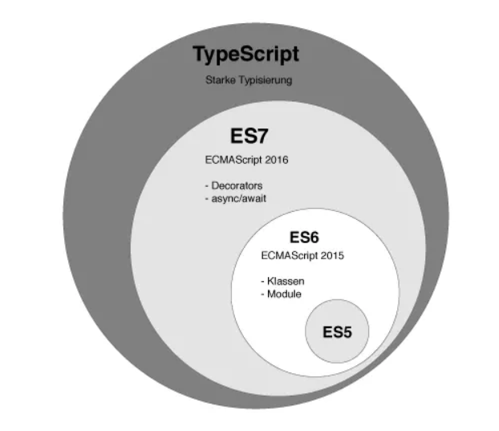

# Typescript 调研

## TS是什么

TypeScript = Type + Script (javascript)。从TypeScript的官网给出的定义：`TypeScript is a typed superset of JavaScript that compiles to plain JavaScript`，中文翻译：TypeScript是一个编译到纯JS的有类型定义的JS超集。

## 为什么选择TS

**一般大型项目需要长期的维护迭代，生命周期可能会持续1~2年，甚至更久，这时保障开发效率的同时也要提升代码的可维护性和生产环境的运行质量至关重要。**

- **开发效率上看** 虽然编写TS需要比传统JS要多写一些代码，但TS在VSCode、WebStorm等其他IDE下可以做到智能提示，智能感知错误代码，同时项目常用的一些其三方库都有TS类型声明，对于那些没有声明的模块我们可以生命文件。
- **可维护性上看** 长期迭代维护的项目开发和维护的成员会有很多，团队成员水平会有差异，而软件具有**熵**的特质，长期迭代维护的项目总会遇到可维护性逐渐降低的问题，有了强类型约束和静态检查，以及智能IDE的帮助下，可以降低软件腐化的速度，提升可维护性，且在重构时，强类型和静态类型检查会帮上大忙，甚至有了类型定义，会不经意间增加重构的频率（更安全、放心）。
- **线上运行时质量上看** 公司现在的SPA项目很多bug都是由于语法报错、数据调用格式不匹配引起的，由于TS有编译期的静态检查，这让我们的bug尽可能先灭在编译开发期间，加载IDE有智能纠错，编码的时候就能够提前感知bug的存在，这样就能让我们的项目在线上运行时更加的稳定。

TS适合大规模JavaScript应用，正如他的官方宣传语`JavaScript that scales`。从以下几点可以看到TS在团队协作、可维护性、易读性、稳定性（编译期提前暴露bug）等方面上有着明显的好处：
- 加上了类型系统，对于阅读代码的人和编译器都是友好的。对阅读者来说，类型定义加上IDE的智能提示，增强了代码的易读型；对于编译器来说，类型定义可以让编译器揪出隐藏的bug。
- 类型系统+静态分析检查+智能感知/提示，使大规模的应用代码质量更高，运行时bug更少，更方便维护。
- 有类似VSCode这样配套的IDE支持，方便的查看类型推断和引用关系，可以更方便和安全的进行重构。
- 给应用配置、应用状态、前后端接口及各种模块定义类型，整个应用都是一个个的类型定义，使协作更为方便、高效和安全。

## TS能干点什么

### 静态检查
> 这类问题是ESLint等工具检查不出来的。

#### 低级错误
```js
const lists = [{
    name: 'lilei',
    age: 15
}, {
    name: 'tom',
    age: 18
}]

const isTom = lists.find(v => v.sex == 1)
```
执行TS编译命令tsc，会执行报错：
```js
Property 'sex' does not exist on type '{ name: string; age: number; }'.
```

#### 非空判断
```js
let data = {
  list: null,
  success: true
};
const value = data.list.length;

```
执行tsc编译：
```js
Cannot read property 'length' of null
```

`data.list.length`这行直接引用了`data.list`的属性，但`data.list`的数据格式有不是数组的可能性，这种场景在前端处理后端接口返回时经常出现，接口返回的数据层级可能非常深，如果在某一级缺少了非空判断逻辑，那就意味着埋下了一个不知道什么时候就会引爆的炸弹。

#### 类型推断
```js
const arr = [];
arr.toUpperCase();

class Cat {
  miao() {}
}

class Dog {
  wang() {}
}
const cat = new Cat();
cat.wang();
```
执行tsc编译：
```ts
Property 'wang' does not exist on type 'Cat'.
```

TS有类型推断，给不同类型的执行对象调用错误的方法都将被检查出来。

#### 面向对象编程增强

##### 访问权限控制
```ts
class Person {
    protected name: string;
    public age: number;
    constructor(name: string) {
        this.name = name
        this.age = 18
    }
}

class Employee extends Person {
    static number = 1;
    private dept: string;
    constructor(name: string, dept: string) {
        super(name);
        this.dept = dept;
    }
}
const howard = new Employee("Howard", "Sales");
console.log(howard.name)
```
执行tsc编译：
```js
Property 'name' is protected and only accessible within class 'Person' and its subclasses
```

Person中name属性是protected类型，只能在自己类中或者子类中使用。访问权限控制在面向对象编程中很有用，他能帮忙我们做到信息隐藏，JS面向对象编程的一个大问题就是没有提供原生支持信息隐藏的方案（很多时候都是通过约定编码方式来做）。信息隐藏有助于更好的管理系统的复杂度，这在软件工程中显得尤为重要。

##### 接口
``` ts
interface Inter1 {
  move(): void
}

interface Inter2 {
  run(): void
}

class Base {
}

class Robot extends Base implements Inter1, Inter2 {
  run() {
    console.log('run');
  }
  move() {
    console.log('move');
  }
}

```

Robot类可以继承Base类，并实现Inter1和Inter2接口，这种可以组合继承类和实现接口的方式使面向对象编程更为灵活、可扩展性更好。

##### 泛型
```ts
interface GenericIdentityFn<T> {
    (arg: T): T;
}

function identity<T>(arg: T): T {
    return arg;
}

let myIdentity: GenericIdentityFn<number> = identity;

// or 
class GenericNumber<T> {
    zeroValue: T;
    add: (x: T, y: T) => T;
}

let myGenericNumber = new GenericNumber<number>();
myGenericNumber.zeroValue = 0;
myGenericNumber.add = function(x, y) { return x + y; };
```

定义了一个模板类型T，实例化GenericNumber类时可以传入内置类型或者自定义类型。泛型（模板）在传统面向对象编程语言中是很常见的概念了，在代码逻辑是通用模式化的，参数可以是动态类型的场景下比较有用。

##### 类型系统
```ts
interface SystemConfig {
  attr1: number;
  attr2: string;
  func1(): string;
}

interface ModuleType {
  data: {
    attr1?: string,
    attr2?: number
  },
  visible: boolean
}

const config: SystemConfig = {
  attr1: 1,
  attr2: 'str',
  func1: () => ''
};

const mod: ModuleType = {
  data: {
    attr1: '1'
  },
  visible: true
}

```

我们定义了一个系统配置类型SystemConfig和一个模块类型ModuleType，我们在使用这些类型时就不能随便修改config和mod的数据了。**每个被调用方负责自己的对外类型展现，调用者只需关心被调用方的类型，不需关心内部细节**，这就是类型约束的好处，这对于多人协作的团队项目非常有帮助。

#### 模块系统增强
```ts
namespace N {
  export namespace NN {
    export function a() {
      console.log('N.a');
    }
  }
}

N.NN.a();
```
TS除了支持ES6的模块系统之外，还支持命名空间。这在管理复杂模块的内部时比较有用。

## 使用TS的成本

### 学习成本
理论上学习并应用一门新语言是需要很高成本的，但好在TS本身是JS的超集，这也意味着他本身是可以支持现有JS代码的，至少理论上是这样。学习一下类型系统的相关知识和面向对象的基础知识，应该可以hold住TS，成本不会很高。

### 应用成本

#### 老项目
对老项目来说，由于TS天然兼容ES规范，所以可以比较方便的将现有的JS项目代码，逐步的加类型注解，渐进式的增强代码的健壮性。

1. `npm`全局安装`typescript`包，并在工程根目录运行`tsc --init`，自动产生`tsconfig.json`文件。
2. 初始化得到的`tsconfig.json`无需修改，增加"`allowJs": true`选项。
3. 配置`webpack`配置，增加ts的loader，如`awesome-typescript-loader`。(如果不需要使用ts-loader进行代码编码转移可继续使用babel进行代码编译)
4. 此时你的项目可以保持.js|jsx不动，也可进行更改为.ts|.tsx，它可以和现有的ES6代码共存，VSCode会自动校验这部分代码，webpack打包也没问题了。
5. 渐的，开始打算重构以前的ES6代码为TS代码，只需将文件后缀改成ts(x)就行，就可以享受TS及IDE智能感知/纠错带来的好处。

#### 新项目

对于新项目，微软提供了非常棒的一些[Starter项目](http://www.typescriptlang.org/samples/index.html)，详细介绍了如何用TS和其他框架、库配合使用。如果是React项目，可以参考这个Starter：[TypeScript-React-Starter](https://github.com/Microsoft/TypeScript-React-Starter)

### 成本对比
| 成本 | ES | TS | 说明 |
| --- | --- | --- | --- |
| 学习和踩坑成本 | ※※※※※ | ※※※ | 虽然是JS超集，但还是要学习TS本身及面向对象基础知识，开发环境搭建、使用中的问题和坑也需要自己趟，好在TS社区比较成熟，网上沉淀的资料很多 |
| 整体代码量 | ※※※※※ | ※※※ | TS代码增加比较完善的类型定义的话整体代码量比原生ES多5%~10%左右 |
| 原生JS（标准ES、浏览器端、服务器端） | ※※※ | ※※※※※ | IDE内置了详尽的类型声明，可以智能提示方法和参数说明，提升了效率 |
| 第三方依赖库 | ※※※ | ※※※※※ | 有TS类型声明库，IDE智能提示和分析，效率提升 |
| 代码可维护性 | ※※ | ※※※※ | 由于团队成员水平差异，和软件的熵的特质，长期迭代维护的项目总会遇到可维护性的问题，有了强类型约束和静态检查，以及智能IDE的帮助下，可以降低软件腐化的速度，提升可维护性，且在重构时，强类型和静态类型检查会帮上大忙，甚至有了类型定义，会不经意间增加重构的频率 |
| 运行时稳定性 | ※※ | ※※※※ | 由于TS有静态类型检查，很多bug都会被消灭在上线前 |

### 小结
从上面的对比中可以看到，使用大家都熟悉的ES作为开发语言只在学习和踩坑成本以及整体代码量上占优，如果只是短期项目，那用ES无可厚非，但我们的项目生命周期持续好几年，是持续迭代升级的，目前TS社区已经比较成熟，学习资料也很多，而且TS带来的是内部协作开发效率、可维护性、稳定性的提升，所以从长远来看这个代价是值得付出的。而且各种类型声明定义文件的存在，是可以提升开发效率的；而且静态类型检查可以减少bug数量和排查bug的难度，变相也提升了效率，而且使整个项目相对变得更为稳定可控。

## 社区发展
从Stackoverflow的[2019年开发者调查报告](https://insights.stackoverflow.com/survey/2019#technology-most-loved-dreaded-and-wanted-languages)、[npm下载量趋势](https://www.npmtrends.com/typescript)上可以到看，`TypeScript`社区发展很快，特别是最近几年。`VS Code + TypeScript`的组合让前端圈产生了一股清流，生产力和规范性得到了快速提升。从Google对TS的支持（Angular高于2的版本是TS写的）看到，国际大厂也是支持的。

## 周边生态

### 类型声明包
React、及其他各种著名框架、库都有TS类型声明，我们可以在项目中通过npm install @types/react方式安装。可以在[这个网站](http://microsoft.github.io/TypeSearch/)搜索你想要安装的库声明包。安装后，写和那些框架、库相关的代码将会是一种非常爽的体验，函数的定义和注释将会自动提示出来，开发效率将会得到提升。

### IDE
VS Code、WebStorm等前端圈流行的IDE都对TS有着非常友好的支持，VS Code甚至自身就是TS写成的。

## 对TS的感受
TS刚出来时我是有点抵触的，或者对她的感觉就跟和CoffeeScript、Dart等编译到JS语言差不多，感觉就是其他语言往JS渗透的产物，近一两年，社区中TS的声音越来越强，而我也开始做大型JavaScript应用，随之逐渐重新认识TS，逐渐认识到TS的类型系统、TS的静态检查、VS Code等IDE的强力支持对于开发出可维护性好、稳定性高的大型JavaScript应用的重要性。

## 思考
如何在项目中更好的利用JS的动态性和TS的静态特性，我们需要根据具体的项目实际情况来权衡，如：
- 中小型项目，生命周期不是很长，那就直接用JS吧，不要被TS束缚了手脚。
- 大型项目，并且生命周期很长，那建议试试TS吧，后期她带来的优点不言而喻。
- 如果是框架、依赖库来的公共模块，那更建议用TS,如：Ant Design、Angular 、Ionic。